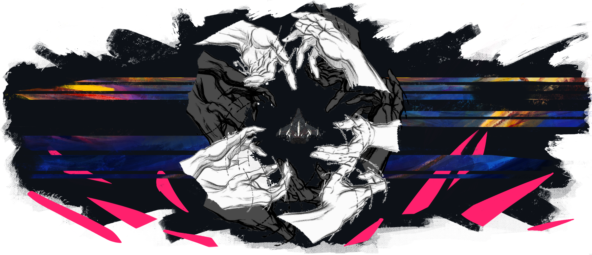
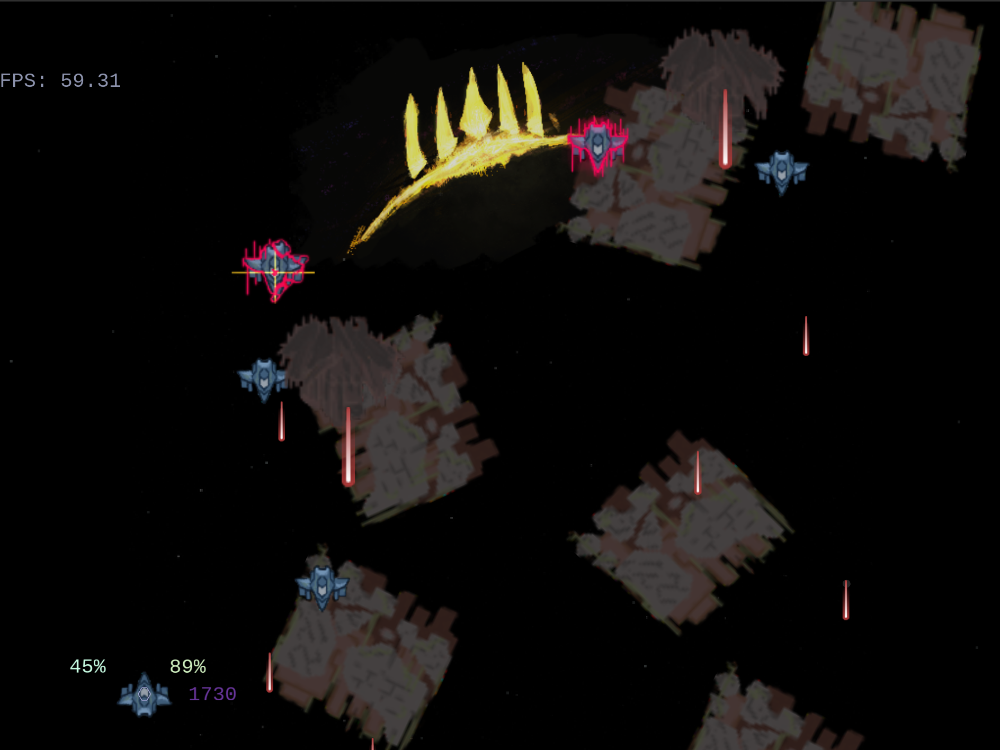

# Tales From the Maelstrom: Alien Invasion

<p align="center">
    
</p>

> Alien Invasion is an unfiction classic space invaders-like arcade shmup written on python 3 and [arcade](https://github.com/pythonarcade/arcade) library based around the lore of **Maelstrom Takes Toll** fictional universe and its canon body of stories under **Tales from the Maelstrom** umbrella.

[](https://www.gnu.org/licenses/gpl-3.0)
[](https://github.com/psf/black)
[](https://github.com/charliermarsh/ruff)

## Introduction

---

_Rescently I was approached by ETE representative with a quite a job of restoring some scrambled data off the ETE-labeled and sealed hard drives. As he said, the containers, which are most of the time are shielded from a such event affecting the disks, were in fact affected by manifested nearby breach of a much higher than extected magnitude. As a result, most of the storage facilites inside the building, including the building itself were altered beyond recognition, you probably heard about it - suprisingly, no casualties only a massive property damage despite a gruesome look of it. Notably, no watchtowers forecasted such breach taking place, which is alarming to say at least. All in all since the damage was too great for a conventional restorative techniques that's were I come in: ETE says that such outsourcing is beneficial in a long run both for us due to sheer difficulty of the case, their public image, and the ETE's archival puposes, but I suppose there's more to it - Everexpanding Toybox has no less than a massive division of high-class restorative scientists working on same issues._

_Anyway, they are fine with me taking time with this project as long as at least something representing the original will turn out. The source in this repository is everything I managed to recover so far and reconstruct in a cohesive more-or-less working state with a hefty amount of my own's work patched in where recovery is too risky for a time being._

_I'll update the source as soon as I can recover it and throw in together some working version._

`- Messer Erzhmann`

---

## External dependencies

Project is managed with [poetry](https://python-poetry.org/docs/#installation).

On Linux, consider installing `make`. For a first run execute following commands:

```sh
make install
make run
```

Further instructions are described in [`GNUmakefile`](./GNUmakefile).

## Mechanics

Ingame mechanics are described in detail at [mechanics.md](docs/mechanics.md).

Default controls are configured in [configs/config.json](configs/config.json) at `current_keymap`.

## Screenshots


<p>
    <!-- TODO: Add justify-content: center;
    when 6 screenshots -->
    <div style="display: flex; flex-wrap: wrap;">
        
        
        
        
    </div>
</p>

## Build from source

### Linux

Install dependencies:

- `patchelf`

After that run:

```sh
make build
```

Resulting build will be placed to `./run.dist/run.bin`.

## Credits

### Music

Audio conversion is done through [ffmpeg](https://ffmpeg.org).

Music present is licensed under [CC BY-NC 3.0](https://creativecommons.org/licenses/by-nc/3.0/):

- Main menu theme: [I Stare Into The Void - Jaxius](https://mixmastermusic2021.bandcamp.com/track/i-stare-into-the-void)
<!-- - Main menu theme: [Maid Dresses - ILLUSIONS (2022) - pandora box](https://maiddresses.bandcamp.com/track/pandora-box) -->
- Button press sound: [Vine boom sfx](https://www.youtube.com/watch?v=Oc7Cin_87H4)

### Images

Following images present are licenced under [Creative Commons | Attribution-NonCommercial 4.0 International | CC BY-NC 4.0](https://creativecommons.org/licenses/by-nc/4.0).

- [Hand Anatomy - Proportions And Measurements (1042x1432)](http://getdrawings.com/get-drawing#hand-anatomy-drawing-37.jpg) - cropped

### GAIA Observatory Images

Following images are licensed under [ESA/Rosetta/NAVCAM – CC BY-SA IGO 3.0](https://imagearchives.esac.esa.int/index.php?/page/copyright_information):

- [ROS_CAM1_20100609T033505_P.png](https://imagearchives.esac.esa.int/picture.php?/6029/category/45)

[Licensing text](https://creativecommons.org/licenses/by-sa/3.0/igo/)
